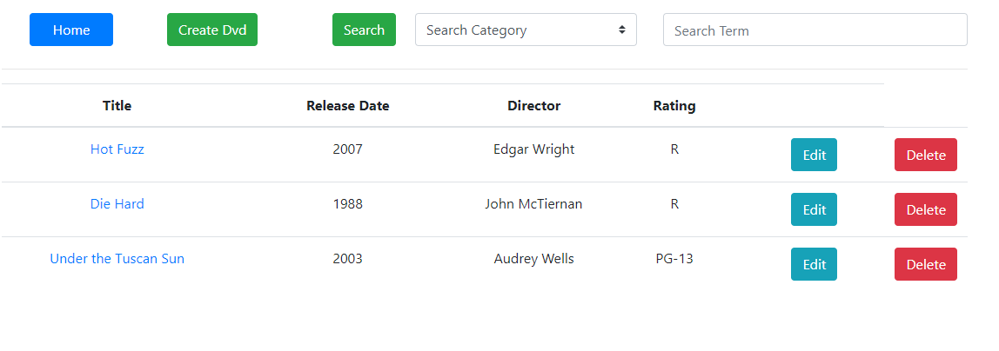

# DVD Library Web Application

A simple, yet dynamic single-page web application that implements CRUD functionalities to maintain a collection of DVDs. The UI allows users to maintain access to a full list of their collection and features the quick, user-friendly ability to add to, edit, search through their collection.

(Makes AJAX calls to an external REST api)

Technologies Used:

